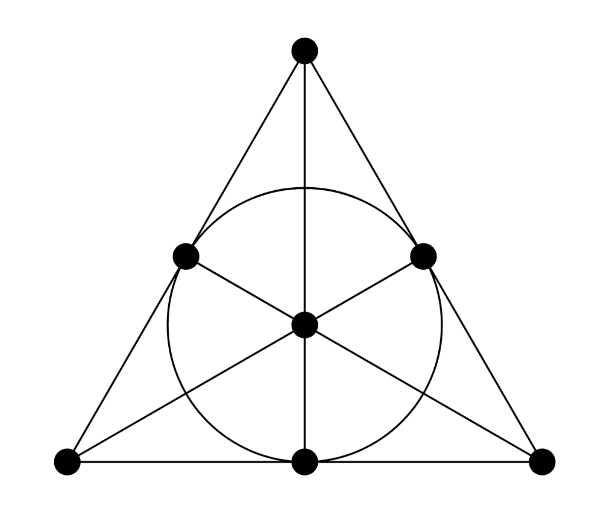
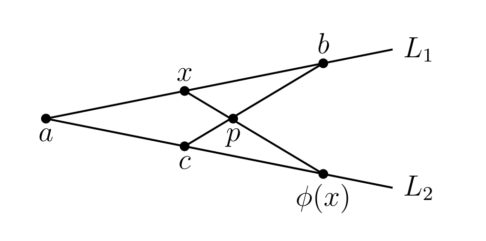
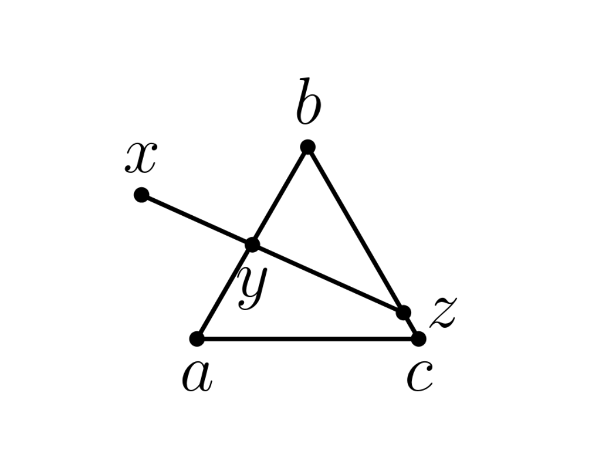

# Exploration of Finite Geometry
<!-- _class: center invert -->

*An exploration of order and dimension via axioms in finite geometry 
by Danielle Voznyy*

<!--
Today I want to dive a into the field of finite geometry through the lens of sets and axioms.

We'll explore how we can think about geometric properties like dimension even with abstract elements where this concept isn't as obvious.
-->

---

### **Definition 1**: A (finite) geometry

Let $P$ be nonempty a (finite) set and $\mathcal{L} \subseteq \mathcal{P}(P)$, be a nonempty subset of the power set of $P$, then $(P, \mathcal{L})$ is finite a geometry.  
  
- We call an element of $P$ a point in our geometry, and an element of $\mathcal{L}$ a line.  
- We say a point $p$ is on a line $L$ when $p \in L$ and lines $L_1, L_2$ intersect when $L_1 \cap L_2 \neq \emptyset$.
<!--
We begin with a definition of a finite geometry using two sets, a nonempty set of points P and a subset of its power set L, that is a set of sets of points.
-->

---

# Types of finite geometries

- We can now use axioms to categorize finite geometries.
- Two well known types, *affine* and *projective* (differing in the existence of parellel lines.)
- Turns out both are quite similar, though projective is easier to work with.
- We'll work with finite projective spaces only to keep definitions to a min.

<!--
We can now use axioms to categorize finite geometries.

You'll often see two types mentioned, affine and projective, where affine geometries have parallel lines, and projective geometries by their construction do not.

Despite their differences these two turn out to be quite similar, with projective geometries simplifying some theorems.

So we'll focus on these going forward to keep our definitions to a minimum.
-->
---

### **Definition 2**: A projective space

A projective space is a geometry such that,

- **A1**: For distinct points $p, q$, there is exactly one line $L$ such that $\{p,q\} \subseteq L$. 
  We call it the line containing $p, q$, or just the line $pq$.
- **A2**: Given distinct points $a,b,c,d$, if $ab$ intersects $cd$, then $ac$ intersects $bd$
- **A3**: Any line contains at least 3 elements.
- **A4**: We call this projective space a *projective plane* if any two lines have at least one point in common, i.e. they intersect
- **S1**: To avoid simple cases, we add that at least two lines (and thus points) exist.
<!-- 
We define a projective space as a geometry that satisfies the following axioms
<read A1, A4>
Finally, to avoid simple cases we add that two lines, and so by Axiom 3, 2 points exist.
-->

---

# The Fano plane
<!-- _class: thm -->
- The smallest projective plane, containing 7 points and 7 lines.
- Same number of points and lines
- All lines contain 3 points
- Does this generalize?

<!-- The Fano plane is a famous example of a projective plane. To the right is an illustration of its sets of points and lines. We can routinely verify that they satisfy our axioms-

But m ore interesting is that this plane contains the same number of points and lines and that all lines contain the same number of points.

We might wonder now, does this generalize to other projective spaces?
-->

---

# Properties of finite projective spaces

In fact, both concepts do:
- **Duality**: Theorems about lines on a projective plane also have duals regarding points (dual spaces in higher dimensions.)
- **Order**: In finite spaces, the second gives rise to a concept of order.

<!-- In fact, both of these concepts do,

We call the first concept duality, where theorems about lines on projective planes have duals regarding points, and vice versa. More broadly, in projective spaces there's an idea of a dual space for which this holds.

The second also holds, and in finite spaces gives us a positive number we call order
-->

---
## **Theorem 1**: Lines have the same number of points

Given a finite projective space $(P, \mathcal{L})$, there exists a positive integer $q$ such that any line in $\mathcal{L}$ contains exactly $q+1$ elements. We call $q$ the order of this space.
<!-- 
We'll define this using a theroem: <read slide>
-->

---
<!-- class: thm -->
## Proof:
Given any two lines $L_1, L_2$, we'll argue there exists a bijection $\phi: L_1 \rightarrow L_2$.

When our set of points is finite, this implies the existence of an integer order.
If $L_1 = L_2$ we are done, so we consider distinct lines.  

<!-- 
We'll start our proof with two lines, and create a bijection between them. For finite sets this will give us a positive integer order.

First, if our lines are equal they contain the same number of points and we are done, so we consider distinct lines.
-->
---

## **Case 1**: $L_1$ intersects $L_2$. 

Then $\{a, b\} \subseteq L_1$ and $\{a, c\} \subseteq L_2$ for some points $a,b,c$, by **A3**.

By **A3** again, let $p \in bc$ be distinct. Then $p \notin L_1, L_2$, otherwise $L_1 = L_2$ by **A1**.

Then given any other point $x \in L_1$, consider the line $xp$. We'll show this must intersect $L_2$ and call the intersection point $\phi(x)$.

<!-- 
We consider the case where these two lines intersect at a point a.

The lines each contain at least three points by Axiom 3, so we'll add points b and c as shown.

Again using axiom 3, we can find a distinct point p on the line bc.

We can also show that p must not lie on L1 or L2, otherwise we could construct a chain of equal lines using axiom 1 and show that L1 equals L2.

Then, we consider a distinct point x in L1. We'll show the line xp must intersect L2 at a unique point that we'll call phi of x.
-->

---

  

**A2**: If $xa$ intersects $pc$, then $xp$ intersects $ac$. 

We have $pc=bc$ and $xa = ab$, so the lines intersect at $b$ as wanted.

We define $\phi(x)$ with domain $L_1$ as follows:  
  
$$
    \phi(x) =    \begin{cases}        xp \cap L_2 & \text{if } x \neq a \\        a & \text{if } x = a    \end{cases}
$$

<!-- 
By axiom 2 if the line xa intersects pc, then xp intersects ac
These two lines intersect at point b, so xp does in fact intersect L2.

We'll now define a function phi of x with domain L1 as intersection of the line xp with L_2 (which we just showed must contain a point).

We'll also add that when x is a, phi simply maps it onto itself.
-->
---

  
  
Let $x_2\in L_1$ be distinct from $a, x$ such that $\phi(x_2) = \phi(x)$. Since both lines pass through p, we have $x = x_2$  by **A1**.

By the same logic as earlier, for $y \in L_2$ distinct from $a$, the line $yp$ intersects $L_1$ at a point $x$ such that $\phi(x)=y$.

Finally, since $\phi$ also maps $a \in L_1$ to $a \in L_2$, $\phi$ is a bijection from $L_1$ to $L_2$.

<!-- 
Now we'll show that phi is a bijection.

Given any other point x2 in L1 we have the lines p (phi of x) equal to p (phi of x2), and so x equals x2 by axiom 1.

Next, using the same logic as earlier, for any y in l2 that isn't 'a', the line yp intersects L1 at a point x such that phi of x equals y

Finally since phi also maps 'a' onto itself, it is a bijection from L1 to L2
-->

---
  
## **Case 2**: $L_1$ does not intersect $L_2$.  
Let $x \in L_1, y \in L_2$, then the line $L_3 \coloneqq xy$ intersects with both $L_1$ and $L_2$, so from case 1 we have two bijections:

$\phi_1: L_1 \rightarrow L_3$ and $\phi_2: L_3 \rightarrow L_2$, and thus a bijection $\phi_1 \circ \phi_2: L_1 \rightarrow L_2$. $\square$

<!-- 
In the case that L1 does not intersect L2, we simply draw a line through L1 and L2.

Since this new line intersects both lines, from case 1 we get two bijections such that their composition is a bijection from L1 to L2 as wanted
-->

---
<!-- class: invert -->

# Dimension of finite projective spaces

- The term *plane* seems to imply a two-dimensional space, but we just added one axiom: *any two lines intersect*.
- What does dimension even mean for the abstract sets we used?

<!-- 
Another interesting property of finite projective spaces is their dimension.

Earlier, we used the term plane, which gives an idea of a two-dimensional space.

But planes differed in just one axiom, any two lines intersect-

What did this axiom change to imply a two dimensional space, and what does dimension even mean for the abstract sets we used?
-->

---  

# Dimension from coordinates

- Another definition of projective spaces uses 1-dimensional vector subspaces of a vector space like $\mathbb{R}^n$.
- Easier to imagine the dimension as coming from the coordinate system.
- We can generalize a concept of dimension based on this.

<!-- 
You'll typically see another definition of projective spaces based on 1-dimensional vector subspaces of a vector space like Rn.

In this case dimension arises intuitively from the coordinate system of this space--If our points need three coordinates, we have a three dimensional space.

We can generalize concepts from vector spaces to get an interesting definition for dimension.
-->

---

## **Definition 3**: Subspace
A subspace of a projective space $(P, \mathcal{L})$ is a projective space of points $X \subseteq P$ and lines $\mathcal{Y} \subseteq \mathcal{L}$,  such that any line containing two points of $X$ is completely contained in $X$.

## **Definition 4**: Geometric dimension

The geometric dimension of the space $(P, \mathcal{L})$ is said to be $n$ if that is the largest number for which there is a strictly ascending chain of subspaces of this form:

$$
\emptyset = X_{-1}\subset X_{0}\subset \cdots X_{n}=P.
$$

<!-- 
We define a subspace as a subset of points and lines of another projective space, such that when the subspace contains two points, it also contain the full line passing through those points. 

Then, we define the geometric dimension of our projective space to be n if n is the largest number for which there is a strictly ascending chain of subspaces going from the empty set to the full set of points.
-->
--- 
<!-- class: thm -->

## **Theorem 2**:
Projective planes are projective spaces of dimension 2.

<!-- 
To understand how this definition relates to dimension, we'll show that projective planes are projective spaces of geometric dimension 2.
-->
---

#### **Proof** pt. 1: *The dimension of our plane must be at least 2.*

Let $P$ be the set of points in our plane, noting $|P|\geq 2$ by **S1**.
  
Consider $a \in P$, $\{ a \}$ is a subspace of $P$ vacuously.

Given any other point $b$, $ab$ is the only line that passes through two points of $ab$ by **A1**. So $ab$ is a subspace since $ab \subseteq ab$. 

Finally, $P$ has at least two lines by **S1**, so $ab \subset P$. 

We have a chain of subspaces $\emptyset \subset \{a\} \subset ab \subset P$, thus our geometric dimension is at least 2.

<!-- 
Choosing an arbitrary point 'a', the set containing just a is a subspace of P vacuously, since it doesn't contain two points.

Choosing another arbitary point b, the line ab is the only line passing through two points of itself by Axiom 1. And since ab is a subset of itself, it is a subspace of P.

Finally, since P has at least two lines by our extra supposition, ab is a strict subset of P.

So, we have an ascending chain of subspaces from the empty set to P that implies a dimension of at least two.
-->
---

#### **Proof** pt. 2: *The dimension of our plane must be at most 2.*

In a maximal chain of subspaces, any subspace $X_i$ must have that there does not exist a subspace $X$ for which $X_{i-1} \subset X \subset X_i$.

Since any nonempty subspace $X$ must contain a point $a$ and $\{a\}$ is a subspace with no sets existing between $\emptyset$ and $\{a\}$, so we must have in our chain that $X_0 = \{a\}$.
  
Similarly, since $X_0 \subset X_1$, $X_1$ contains at least another point $b$, and again the line $ab$ is a subspace. Any strict subset of $ab \neq \emptyset, \{a\}$ would not contain the line $ab$ in full and thus cannot be a subspace. So it must be that $X_1 = ab$.

<!-- 
To give an upper bound for our dimension, we'll consider a maximal chain of subspaces.

What makes such a chain maximal is that another subspace cannot exist strictly between any two subspaces, otherwise we could form a logner chain.

We'll now show our construction from part 1 must be the only way to construct a maximal chain.

Any nonempty subspace X must contain at least one point 'a'. We showed in part 1 that the set containing 'a' is a subspace. Moreover, the only strict subset of the set containing a is the empty set.

So the first nonempty subspace, X0, in any maximal chain must be of this form. Otherwise, we can take a point in X0, and form a strictly smaller subspace using it, which contradicts the chain being maximal.

Similarly, the next subspace X1 in the chain must containe at least another element b, and again from part 1 the line ab is a subspace.

Any strict subset of ab that isnt just the empty set or the set containing a, would not contian the line ab in full, so it cannot be a subspace.

So again X1 in our chain must be of the form ab, otherwise we could choose two points in X1 and form a strict subset using the line ab.
-->
---

  
Now, since $X_1 \subset X_2$, we must have a distinct $c \in X_2$ such that $c \notin X_2 = ab$.

So we have three distinct points $a,b,c$ which form three distinct lines by our choice of $c$. We'll show any other line in our space must also be in $X_2$.  

Let $x,y \in P$ be arbitrary points, wlog we can say $y \in ab$ since by **A4**, $xy$ must intersect $ab$ at some point. Let $xy$ also intersect $bc$ at $z_1$, and $ac$ at $z_2$.

<!-- 
Now, the next subspace X2 in our chain contains at least another point c which isnt be on the line ab from before, otherwise X2 would just be the line ab.

So we have three distinct points a, b, c, which form three distinct lines because c does not lie on ab.

We'll show that any other line in our space must be contained in this subspace, so it must be the final subspace in the chain.

We choose two arbitrary points x, y in P and without loss of generality can say that y lies on ab, since by axiom 4, xy must intersect ab at some point.

Now, we consider the two other intersection points of xy with bc and ac. We'll call them z1 and z2
-->
---

Intuitively, we just constructed a triangle where, regardless of our choice of $x$, we'll have a distinct point $z$ on one of $ab$ or $bc$ (because $xy$ must intersect them.)

It just remains to show that one of $z_1$ or $z_2$ must be the distinct $z$ in our illustration.

<!-- 
Intuitively, we just constructed a sort of triangle where, regardless of where we place x, we'll have a distinct point z on one of the remaining lines because each line must intersect.

You might imagine moving x around as much as you like, but because y has to be on the line ab, the only way we'll pass through only one point on the triangle is if y is precisely a or b. 

However, this is impossible because xy would not intersect one of the lines, contradicting axiom 4.

To show this more more rigorously, we'll verify that indeed one of z1 or z2 must be distinct from y.
-->
---

Suppose $y = z_1 = z_2$, then we have that all three lines $ab,bc,ac$ share one point $y$.

Then $\{b, y\} \subseteq ab$ and $\{b, y\} \subseteq bc$, so $ab = by = bc$ by **A1**. But this **contradicts** $ab, bc$ being distinct lines. Thus, we must have that $y \neq z$ where $z$ is one of $z_1$ or $z_2$. 

<!-- 
Suppose all three points are equal, then the three edges of our triangle abc, share one point, y.

But then the lines ab and bc both contain points b and y, and thus by axiom 1 must be the line by. But this contradicts ab and bc beign distinct lines.

Thus, y must be be distinct from one of z1 or z2, we'll call this point z.
-->
---

Finally, we've shown $xy$ contains points $y,z \in X_2$, and since $X_2$ is a subspace we must have that $xy \in X_2$  

So $X_2$ = $P$ since any two points in $P$ form a line (containing them) that is fully contained in $X_2$.

Thus, our geometric dimension is at most 2. $\square$

<!-- 
This means the line xy contains points y and z in our subspace X2.

So, by properties of subspaces, the full line xy is contained in X2.

Since this is true for any arbitrary pair of points in P, X2 has to be P itself.

Thus we can't form a longer chain, and since we ended at X2, our geometric dimension is at most 2.
-->
---
<!-- class: invert -->

## Intuition for geometric dimension

- The chain of subspaces is akin to talking about different objects of increasing dimension in our space.
- That is, points in lines, lines in planes ... up to the full space itself.

<!-- 
Our proof illustrates how the chain of subspaces in our definition is akin to talking about different objects of increasing dimension, from points to lines, up to the full space itself.

A space of higher dimension has more of these objects contained within each other, and thus can form a longer chain.
-->
---

# Future developments

  
- Order and dimension are powerful tools for classifying finite geometries.
- We use $PG(n, q)$ to talk about finite projective spaces that arise from finite fields.
- Projective spaces of dimension $n \geq 3$ can always be described using such a field thanks to Veblen-Young.
- Finite projective planes are much harder to classify, since they can be constructed in more ways.

<!-- 
As it turns out, order and dimension are powerful tools for classifying finite geometries.

In fact, we use the notation PG(n, q) to talk about finite projective spaces of dimension n and order q+1 that arise from a finite field of size q

The Veblen-Young theorem shows finite projective spaces of three dimensions or higher can always be described using such a field.

However, finite projective planes are much harder to classify, since they can be constructed in more ways. Specifically, planes that do not satisfy Desargues' theorem.
-->
---
## An open conjecture

*The order of a finite projective plane is always a prime power.*

- The number of finite projective planes is only known up to order 10: $1, 1, 1, 1, 0, 1, 1, 4, 0$ 
- The Bruck-Ryser theorem states if for positive integer $n$,  $n \equiv 1,2\ (mod\ 4)$ and $n$ is not the sum of two squares, then no plane exists of order $n$.

<!-- 
I'll leave you with an open conjecture, we think the order of a finite projective plane is always a prime power.

It turns out we only know the number of non-isomorphic finite projective planes up to order 10. This is because of the computational complexity of counting these planes using brute force.

The closest we have come to a proof of this conjecture is the Bruck-Ryser theorem which rules out integers congruent to 1 or 2 modulo 4, which are not the sum of two squares.
-->